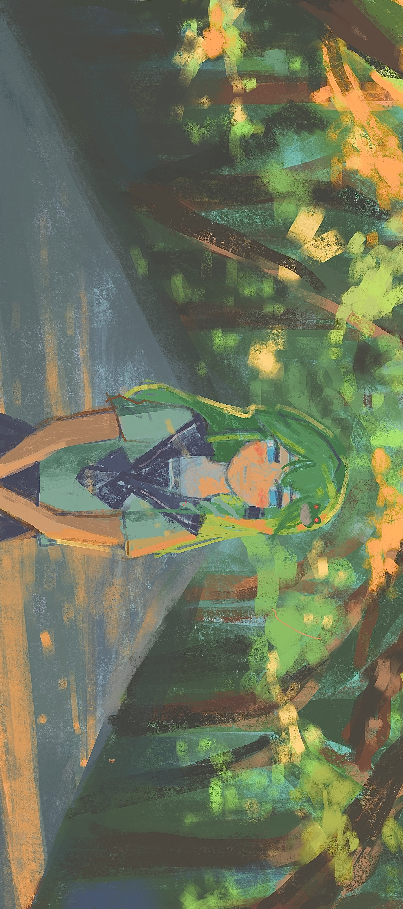

## Hi, I'm Scabbards1500!👋

  

You can call me 1500 or 00. My mental state is barely holding up, thanks to the unwavering support of 🐸Sanae Kochiya🐍. 
As I'm in the midst of application season, updates here may be slow. I warmly welcome everyone to connect, learn, and collaborate with me! 😊

  

- 🔭 I’m currently working on: Multimodal Large Language Models (MLLMs), LLM reasoning, Vision-Language Alignment  
- 🌱 I’m currently learning: LLM application 
- 📝 I regularly write articles on [https://blog.csdn.net/Scabbards_?spm=1011.2124.3001.5343] 
- 📫 How to reach me: scaaabbards@gmail.com 
- 🐦 Twitter: @__Scabbard 

### Languages and Tools:

 

<!-- Core Languages -->

<!-- AI / ML -->

<!-- Systems / Tools -->

